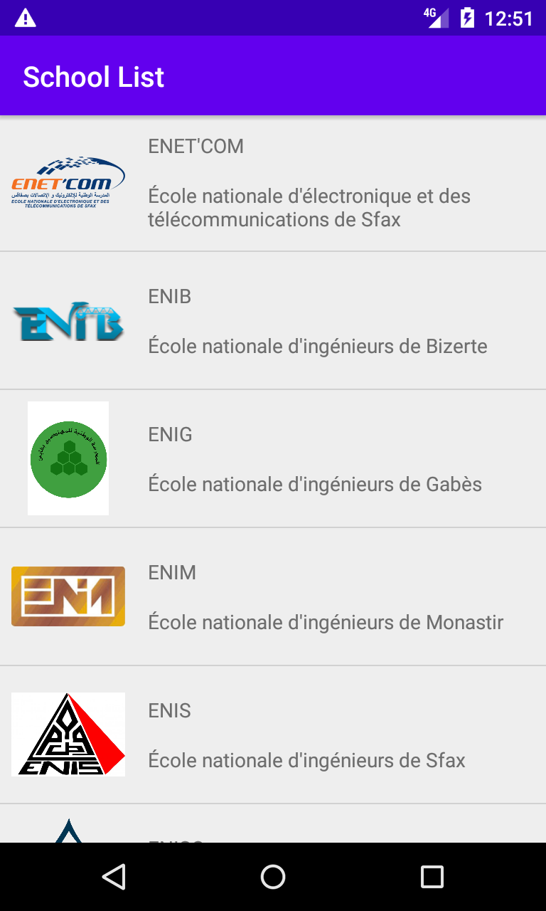
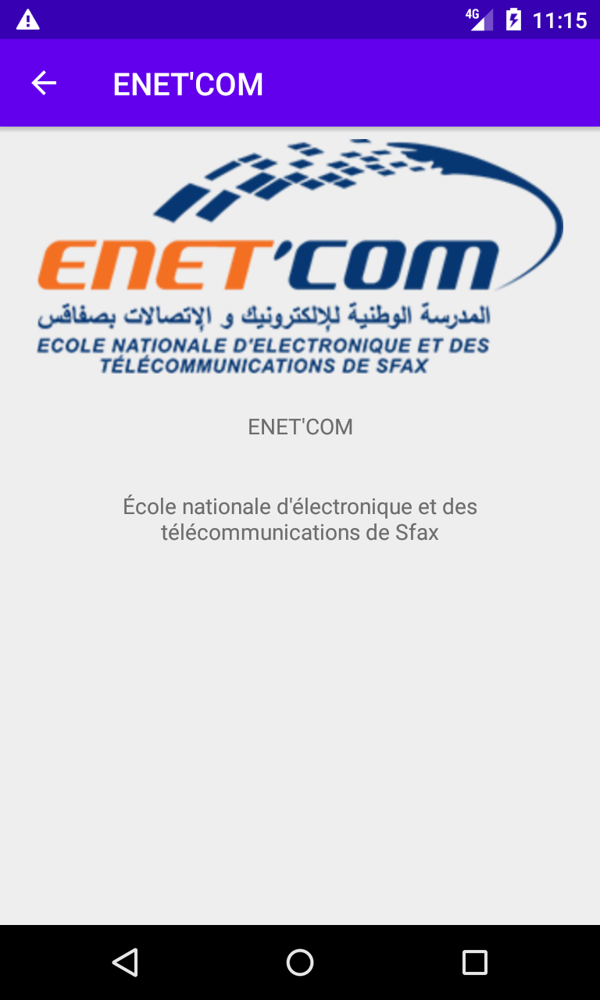

# TD Exercise 1 - Solution

## Aperçu

"**`School List`**" est une application Android qui affiche une liste des écoles ingénieurs.

## A faire

1. Créer l'application "`School List`":
    - Utiliser un "`RecyclerView`" pour afficher la liste des écoles.
    - Chaque école est présenté par un class "`School`" qui contient les attributs suivantes:
        - `name`: Nom de l'école.
        - `description`: Description de l'école.
        - `logo`: Logo de l'école.
    - Exemple de liste:

        | Nom | Description | Logo |
        |-----|-------------|------|
        |ENET\'COM|École nationale d\'électronique et des télécommunications de Sfax|[assets/logo/logo_enetcom.webp](assets/logo/logo_enetcom.webp)|
        |ENIB|École nationale d\'ingénieurs de Bizerte|[assets/logo/logo_enib.webp](assets/logo/logo_enib.webp)|
        |ENIG|École nationale d\'ingénieurs de Gabès|[assets/logo/logo_enig.webp](assets/logo/logo_enig.webp)|
        |ENIM|École nationale d\'ingénieurs de Monastir|[assets/logo/logo_enim.webp](assets/logo/logo_enim.webp)|
        |ENIS|École nationale d\'ingénieurs de Sfax|[assets/logo/logo_enis.webp](assets/logo/logo_enis.webp)|
        |ENISO|École nationale d\'ingénieurs de Sousse|[assets/logo/logo_eniso.webp](assets/logo/logo_eniso.webp)|
        |ENIT|École nationale d\'ingénieurs de Tunis|[assets/logo/logo_enit.jpg](assets/logo/logo_enit.jpg)|
        |ENSI|École nationale des sciences de l\'informatique|[assets/logo/logo_ensi.webp](assets/logo/logo_ensi.webp)|
        |EPT|École polytechnique de Tunisie|[assets/logo/logo_ept.webp](assets/logo/logo_ept.webp)|
        |ISI|Institut supérieur d\'informatique|[assets/logo/logo_isi.webp](assets/logo/logo_isi.webp)|
        |ISSATSO|Institut supérieur des sciences appliquées et de technologie de Sousse|[assets/logo/logo_issat_sousse.webp](assets/logo/logo_issat_sousse.webp)|
        |SUP\'COM|École supérieure des communications de Tunis|[assets/logo/logo_supcom.webp](assets/logo/logo_supcom.webp)|

2. Créer une nouvelle branche git sous le nom `task-2` à partir de la branche principale.

3. Ajouter une fonctionnalité à l'application qui permet d'afficher plus de détails d'une école dans une autre activité `SchoolActivity` quand l'utilisateur clique sur un élément de liste des écoles de RecyclerView.

    
